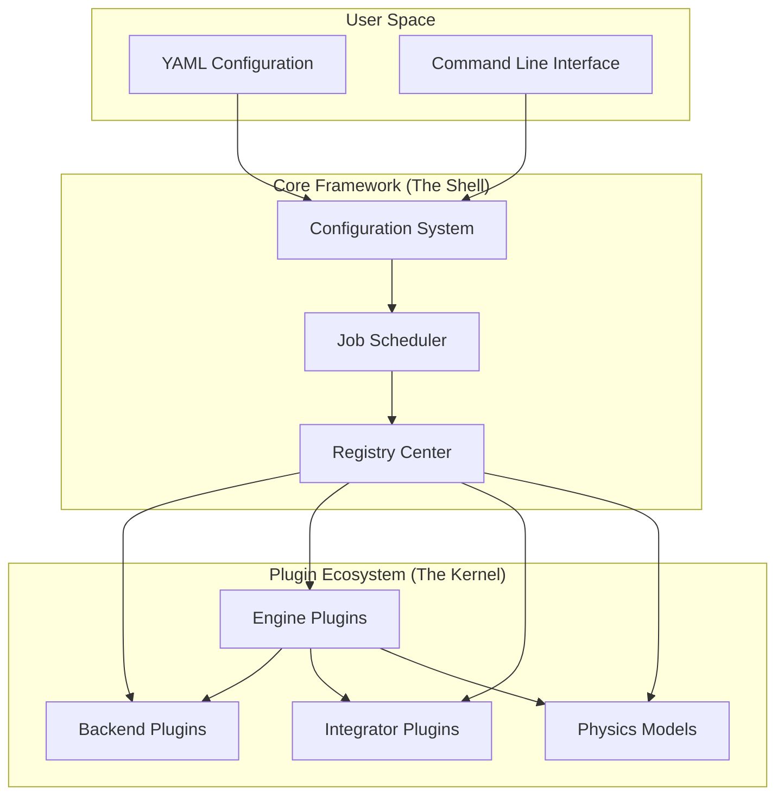
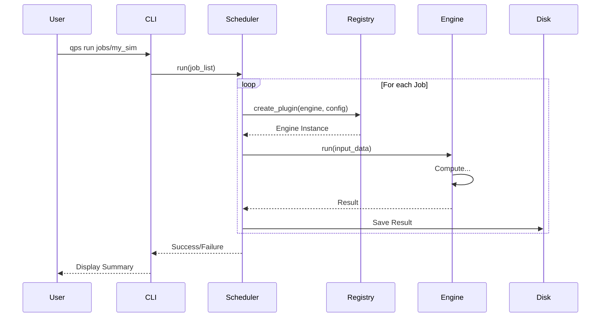

# Architecture Overview

QPhase is built on a **modular, plugin-based architecture**. This design choice ensures that the framework remains flexible and extensible, allowing researchers to add new physics models or numerical methods without modifying the core codebase.

## The "Kernel" and the "Shell"

Conceptually, QPhase is divided into two parts:

1.  **The Shell (Core Framework)**: Handles the "boring" but necessary parts of scientific computing—parsing configuration files, managing command-line arguments, scheduling jobs, and saving results.
2.  **The Kernel (Plugins)**: Contains the actual physics and mathematics—the models, integrators, and backend logic.

This separation means that as a physicist, you mostly work in the **Kernel**, writing plugins that define your system's dynamics. The **Shell** takes care of running your code efficiently and reproducibly.

## Core Components

### 1. The Registry ("The Librarian")
The Registry is the central database of all available components. When you install a QPhase package or add a local plugin, it registers itself here.
*   **Role**: Keeps track of available Models, Integrators, Backends, and Engines.
*   **Benefit**: You can switch components just by changing a name in the YAML config (e.g., changing `backend: numpy` to `backend: torch`).

### 2. The Scheduler ("The Conductor")
The Scheduler orchestrates the execution of simulations.
*   **Role**: Reads your job list, resolves dependencies (e.g., Job B needs output from Job A), and executes them in order.
*   **Benefit**: Handles batch processing and parameter scans automatically.

### 3. The Backend ("The Calculator")
The Backend provides a unified mathematical interface.
*   **Role**: Abstracts away the differences between CPU and GPU libraries.
*   **Benefit**: You write your physics equations once using the generic `backend` interface, and they run on NumPy, PyTorch, or CuPy without modification.

## System Architecture Diagram



## Execution Flow

When you run `qps run jobs/my_sim`, the following happens:

1.  **Load**: The CLI loads `my_sim.yaml` and merges it with `global.yaml`.
2.  **Validate**: The system checks if all requested plugins exist and if the parameters are valid.
3.  **Build**: The Registry constructs the specific Engine, Model, and Backend requested.
4.  **Run**: The Engine executes the simulation loop.
5.  **Save**: The result is saved to disk along with a snapshot of the configuration.



## Directory Structure

A standard QPhase project looks like this:

```text
my_project/
├── configs/
│   ├── global.yaml       # Project-wide defaults
│   └── jobs/             # Job definitions
│       ├── simulation.yaml
│       └── analysis.yaml
├── models/               # Your custom physics models
│   └── my_model.py
├── plugins/              # Local custom plugins
│   └── .qphase_plugins.yaml
├── runs/                 # Output directory
│   └── 2023-10-27T.../   # Timestamped run folder
│       ├── config_snapshot.json
│       └── results.npz
└── system.yaml           # System overrides (optional)
```

